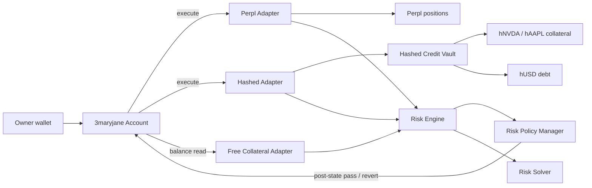

# 3maryjane

**One account. Multiple Monad protocols. Unified clearing, margin, risk, routing, automation, liquidity, and execution.**

3maryjane is a non-custodial cross-protocol clearing and capital layer for Monad. A user-owned account holds capital and owns positions opened on integrated venues. Stateless adapters translate protocol-specific actions into tightly permissioned calls that the account executes itself. The risk stack values and nets those positions across protocols before enforcing owner-defined portfolio limits at transaction level. The intent/automation stack can then plan, route, simulate and dispatch defensive actions without giving agents or keepers unrestricted custody.

The Solidity and SDK code keeps the internal `CL*` contract/type names for stability, but the product and user-facing brand is **3maryjane**.

## Current state

3maryjane has a live Monad testnet deployment for the core clearing/risk stack plus **Hashed**, the equity-backed credit module. The configured demo account currently covers Perpl, direct free collateral and Hashed under one risk policy. Kuru remains in the codebase but its stale testnet target is disabled; Euler is retained as a verified mainnet integration rather than claimed as a live testnet venue.

Implemented:

- deterministic user-owned clearing accounts
- asset custody and policy-aware withdrawals
- version-pinned adapter authorization
- adapter target + exact function-selector permissions
- atomic cross-protocol execution
- Kuru margin + CLOB adapter
- Perpl direct-onchain perp adapter
- Euler v2 lending adapter
- **Hashed stock-backed credit adapter + vault**
- **hNVDA / hAAPL synthetic testnet collateral + hUSD credit**
- protocol-neutral position schema
- unified portfolio ledger read path
- canonical asset/instrument risk registry
- fresh-price fail-closed valuation
- cross-protocol exposure netting by economic underlying
- unified equity, debt, leverage and margin utilization
- portfolio health and critical-move buffer
- scenario/default stress testing
- Portfolio Margin Engine V1
- owner-configured risk policies and per-asset limits
- atomic post-trade policy enforcement
- owner-authenticated economic intents
- conservative same-input capital route ranking
- immutable multi-step plan commitments
- deterministic venue-neutral risk solver
- strict delegated defensive execution
- bounded keeper jobs
- portfolio risk-state simulation
- Chainlink-compatible 1e18 price-source wrapper
- production TypeScript SDK
- read-only Public Risk API
- protocol onboarding manifest framework
- 3maryjane Terminal
- live Hashed wallet demo and **unified clearing-account execution demo**
- exact target/selector permission scripts
- threat model, deployment checklist and Metropolis demo runbook

See `docs/MILESTONES.md`, `docs/RISK_ENGINE.md`, `docs/INTENT_AUTOMATION.md`, `docs/PROTOCOL_ONBOARDING.md`, `docs/THREAT_MODEL.md`, `docs/DEPLOYMENT_CHECKLIST.md`, `docs/HASHED_TESTNET.md`, and `docs/METROPOLIS_SUBMISSION.md`.

## Live Hashed deployment — Monad testnet 10143

| Component | Address |
| --- | --- |
| Demo 3maryjane account | `0x38Ac1B6b3ec3eD28E0b49C5331b01151D1C3577f` |
| HashedCreditVault | `0x63814b52f6c2d366598dc7ed47eb364b41cf9a15` |
| HashedAdapter | `0xF43bc85317345Ce54Fa616440b9b76AF276866eb` |
| hUSD | `0xdcc5b92d7e99f4f31527121a402516f69d3edc27` |
| hNVDA | `0x2ac57e9246e11cbf9899d276f2571d2b4cdfffac` |
| hAAPL | `0x4edd0c5532cdc7c88c91eecbdf355b62ef309cb9` |
| RiskPolicyManager | `0xebf69ede951ff508c0a0cfcbb75c90db186fd834` |
| RiskEngine | `0x4ec4b8062c0eab4dfef9ede4a335e4e165e8ef50` |

The Hashed adapter is active, authorized by the demo account, and included in the account's risk-policy adapter set alongside Perpl and free collateral.

### Architecture



Independent venues keep their own native collateral, margin and liquidation rules. 3maryjane normalizes their positions into a single owner-defined risk surface; it does **not** make independent protocols share collateral.

## Security model

1. Adapters never receive custody.
2. The account uses no adapter `delegatecall`.
3. Every low-level target is explicitly allowlisted per adapter.
4. Production targets can enforce exact 4-byte function selectors.
5. Changing adapter activity, targets, selector permissions or selector enforcement increments its registry version and invalidates prior user authorization until the user re-authorizes.
6. Cross-protocol batches revert atomically when any underlying call fails.
7. Risk enforcement fails closed when a covered adapter cannot be read, a required derivative mapping is missing, or a required price is invalid/stale.
8. When the risk guard is enabled, adapters outside the policy's covered risk universe cannot execute.
9. Withdrawals are subject to post-state policy validation.
10. Delegated defensive operators cannot withdraw and must finish in a strictly safer state; otherwise every underlying call rolls back.
11. Intents, solver output, routing and simulation do not grant execution authority by themselves.
12. The portfolio critical-move metric is a derived cross-protocol adverse-move estimate; independent protocols retain their own native liquidation rules.

This is an implementation threat model and hardening pass, not an independent security audit. See `docs/THREAT_MODEL.md`.

## Monad configuration

- Mainnet chain ID: `143`
- Testnet chain ID: `10143`

Protocol deployment constants live in `packages/sdk/src/protocols.ts`. Live market, vault, instrument and oracle configuration is deliberately explicit rather than guessed or silently baked into the clearing engine. Re-verify network addresses against primary protocol sources immediately before any broadcast.

## Build

```bash
forge build
forge build --sizes --skip script --skip test
forge test -vvv
npm install --ignore-scripts
npm run typecheck
npm run build:apps
```

CI covers Solidity compilation, deployable bytecode sizes, the Forge suite, TypeScript typechecking and production SDK/API/Terminal builds.

## Deployment

The fail-closed production sequence is documented in `docs/DEPLOYMENT_CHECKLIST.md`.

The Hashed + core demo stack is deployed on Monad testnet. Mainnet and any venue-specific integration should only be described as live after its own funded transactions are confirmed and recorded.
