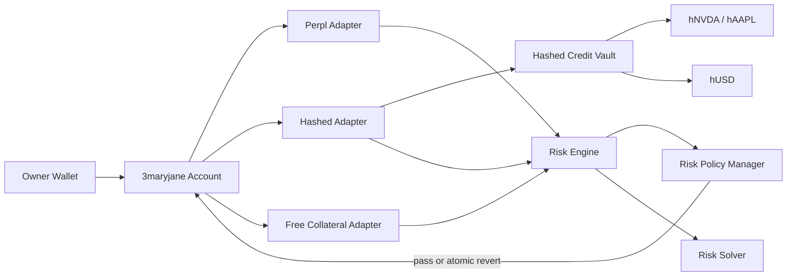

# 3maryjane — Metropolis Submission Pack

## One-line description

**3maryjane is a user-owned clearing and risk layer for Monad that normalizes positions from independent markets into one programmable account and one post-trade risk policy.**

## Short submission description

3maryjane gives a user one non-custodial account for cross-protocol execution and portfolio risk on Monad. Stateless adapters translate venue-specific actions into exact allowlisted calls, while a shared risk engine values and nets the resulting positions before the transaction is allowed to commit.

The live Monad testnet demo combines Perpl, free collateral and **Hashed**, our equity-backed credit module. A user can lock synthetic hNVDA/hAAPL, borrow hUSD through the Hashed adapter and immediately see that collateral and debt inside the same portfolio surface as the other covered venues.

Independent protocols still keep their own native margin and liquidation rules. 3maryjane does not pretend to create protocol-shared collateral; it adds an owner-controlled coordination and risk layer above them.

## Why it matters

Cross-protocol traders, wallets and agents usually rebuild portfolio state independently and execute actions without a common transaction-level policy. 3maryjane turns that fragmented state into one account-level risk surface and can atomically revert a transition if the final portfolio breaches the owner's rules.

## Live Monad testnet proof

Chain: **10143**

Demo account:

```text
0x38Ac1B6b3ec3eD28E0b49C5331b01151D1C3577f
```

Covered risk adapters:

```text
Perpl
WalletBalance / free collateral
Hashed
```

Hashed adapter:

```text
0xF43bc85317345Ce54Fa616440b9b76AF276866eb
```

Hashed adapter was verified active and authorized onchain, and the demo account's risk-policy adapter list was read back after configuration.

## 90-second demo

### 0–12s — thesis

Open the Terminal and say:

> One user-owned account. Multiple Monad markets. One portfolio-risk policy.

Show Monad testnet and the clearing account.

### 12–28s — Hashed asset

Open **HASHED**.

Claim hNVDA or hAAPL from the synthetic testnet faucet. Explain that the demo assets and manual price sources are testnet-only.

### 28–48s — execute through 3maryjane

In **UNIFIED CLEARING DEMO**:

1. fund the 3maryjane account,
2. click **LOCK VIA ADAPTER**,
3. click **BORROW VIA ADAPTER** for a small hUSD amount.

Explain that the wallet is calling the user-owned 3maryjane account, which executes exact Hashed adapter calls and then validates the final portfolio state.

### 48–66s — unified risk proof

Refresh the clearing view.

Point to:

- portfolio equity,
- total debt,
- gross exposure,
- portfolio health,
- policy PASS/BREACH,
- solver action,
- per-asset exposure buckets.

Show that Hashed is marked as covered by the risk guard.

### 66–80s — unwind

Repay hUSD through the adapter and unlock the collateral.

Refresh to show debt/exposure fall again.

### 80–90s — close

Finish with:

> 3maryjane is not another DEX. It is the account, execution and risk layer that lets wallets and agents coordinate capital across Monad protocols without giving up custody.

## Architecture



## Evidence links

Explorer: `https://testnet.monadvision.com`

### Contracts

- demo account: `https://testnet.monadvision.com/address/0x38Ac1B6b3ec3eD28E0b49C5331b01151D1C3577f`
- Hashed vault: `https://testnet.monadvision.com/address/0x63814b52f6c2d366598dc7ed47eb364b41cf9a15`
- Hashed adapter: `https://testnet.monadvision.com/address/0xF43bc85317345Ce54Fa616440b9b76AF276866eb`
- hUSD: `https://testnet.monadvision.com/address/0xdcc5b92d7e99f4f31527121a402516f69d3edc27`
- hNVDA: `https://testnet.monadvision.com/address/0x2ac57e9246e11cbf9899d276f2571d2b4cdfffac`
- hAAPL: `https://testnet.monadvision.com/address/0x4edd0c5532cdc7c88c91eecbdf355b62ef309cb9`

### Configuration transactions

- asset permission: `https://testnet.monadvision.com/tx/0xe061f93e49d4081fb84ec8a681b0fba9d476f6c672bec9f38f08ffce6da7364d`
- adapter authorization: `https://testnet.monadvision.com/tx/0xe5464bd0292af4c7b111c1acf8cf7e79862041daab90886f0114465b51ed25ea`
- risk-policy configuration: `https://testnet.monadvision.com/tx/0x8ca600fdd3b6d69e7296302a3a28ec693ddcef2d13f934cf59673c2e49a5ef23`

## Judge checklist

- Terminal loads on Monad testnet.
- Wallet switches/adds Monad testnet automatically.
- Hashed shows LIVE.
- Demo account loads read-only even before owner wallet connects.
- Hashed risk adapter reads as covered.
- Owner wallet can fund the account and execute Hashed adapter actions.
- Borrow changes debt and unified portfolio metrics.
- Repay/unlock reverses the position.
- Every CI job is green before recording.
- Explorer tabs are open before the recording starts.

## Claims to use

- non-custodial user-owned clearing account
- cross-protocol position normalization
- owner-defined post-trade portfolio risk
- atomic EVM execution across onchain calls
- live Monad testnet Hashed integration
- Perpl + free collateral + Hashed covered by one configured risk policy
- security-hardened and CI-tested

## Claims to avoid

- do not say independent venues share native collateral,
- do not call the demo synthetic equities real shares,
- do not call manual testnet prices production oracles,
- do not describe the system as independently audited,
- do not claim Kuru testnet is live while its stale target remains disabled,
- do not claim Euler is live on testnet,
- do not describe the derived portfolio-health metric as a venue-native liquidation price.

## End-to-end smoke proof — confirmed

The live Monad testnet clearing smoke script completed successfully on 2026-09-23 and restored the Hashed position to its pre-run state after the round trip.

Confirmed transactions from the final sequence:

- adapter execution: `0xe0549f97f08b0bef61f509e50a9a2434b1ebef853805fb5b985c1d6d6092bcb4`
- adapter execution: `0x005fe1897c18f4b29f91d40b24c27c5d455d2934469258f24bfbb4dafc051349`
- adapter execution: `0x598286bf9d59dce3553f64cf22c6abd99d8c15ca7b5df923db921f022667eb00`
- account withdrawal: `0x2445c82b837171eb87ba7e861ffc4dc09237cf27fa73f84929eca04ae4b11474`

The Foundry run reported:

```text
ONCHAIN EXECUTION COMPLETE & SUCCESSFUL.
Total paid: 0.467546973004539291 MON
```

Because `DemoHashedClearingTestnet.s.sol` asserts the final wallet/account collateral balances, Hashed locked collateral, debt, and unified policy state are restored, a successful completion is also evidence that the full open → borrow → repay → unlock → return path completed without leaving residual Hashed state.
